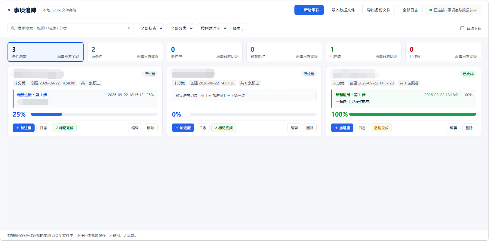

# Trail · 事项追踪

[简体中文](#简体中文) | [English](#english)

> 一个**纯前端、零后端、零数据库**的事件 / 任务 / 问题全生命周期追踪工具。
> 所有数据只保存在**你自己指定的本地 JSON 文件**里，不使用浏览器缓存，不联网，无任何服务端。

---

## 简体中文

### 项目简介

日常工作中的事项（客户问题、待办任务、项目风险、故障处理……）往往散落在聊天记录和便签里，过几天就不知道推进到哪一步了。

Trail 用一个单页网页解决这件事：**新增事项 → 持续记录每一步进展 → 随时看到它现在到哪一步 → 全流程留痕可追溯**。

它不是 SaaS，没有账号，没有服务器，也不需要安装任何东西——打开网页即用，数据是你电脑上的一个 JSON 文件，你自己决定放在哪、怎么备份。

### 核心特性

**事项管理**
- 完整 CRUD：新增、编辑、删除、查看详情
- 内置五种状态：待处理、处理中、暂缓处理、已完成、已作废（不同状态不同配色）
- 截止时间设置，逾期自动标红提醒
- 一键「标记完成」：状态转「已完成」并自动把进度补到 100%，可随时撤销

**进度追踪**
- 0-100% 进度条 + 大号百分比数字，实时反映完成程度
- 每次跟进都可写备注，形成一条时间线（如「材料已提交」「已联系供应商」）
- 卡片上直接显示**最新进展**，不点开就知道事情推进到哪一步
- 进度到 100% 时自动询问是否切换为「已完成」
- 历史进度记录不可随意删除，保证留痕完整

**操作日志**
- 全自动记录：新增、编辑任意字段、修改状态、更新进度、删除，全部留痕
- 日志含操作类型、操作时间、事件名称、**变更前后的值**（如 `状态：处理中 → 已完成`）
- 单事件可查看「基本信息 / 进度日志 / 操作日志」三个页签
- 全局日志页汇总所有操作，支持搜索

**查询与筛选**
- 全局模糊搜索：标题、描述、分类
- 按状态、按分类筛选
- 按创建时间 / 截止时间 / 进度排序，可切换升降序
- 顶部统计卡片可点击：点某个状态直接筛出对应列表，再点一次取消

**本地文件存储（重点）**
- **不用 localStorage / sessionStorage / IndexedDB 存业务数据**——浏览器清缓存、无痕模式都不会导致数据丢失
- 连接数据文件后，每一次改动**直接写回原文件**
- 记住上次的数据文件，刷新页面后自动重连，无需反复选择
- 支持「导入数据文件」还原历史数据、「导出备份文件」随时留档
- 支持把 JSON 文件直接拖拽到页面导入

### 快速开始

**方式一：双击启动脚本（推荐）**

1. 双击 `start.bat`（会后台静默运行，不弹命令行窗口，自动打开浏览器）
2. 浏览器访问 `http://127.0.0.1:8123`
3. 首次使用时选择「新建空白数据文件」，指定一个保存位置（例如「文档」文件夹）
4. 开始使用

不用时双击 `stop.bat` 即可停止服务。

> 需要本机装有 Node.js 或 Python（脚本会自动检测，二选一即可）。

**方式二：直接双击 index.html**

能用，但**不推荐**。浏览器出于安全限制，禁止以 `file://` 方式打开的网页记住并直连本地文件，因此：
- 无法自动保存，每次改动需手动「导出备份文件」
- 刷新页面后需要重新导入数据文件

### 使用说明

| 操作 | 说明 |
| --- | --- |
| 新增事件 | 点右上角「＋ 新增事件」，标题必填，分类/描述/截止时间选填 |
| 加进度 | 卡片上蓝色主按钮「＋ 加进度」，填写进度值和这一步做了什么 |
| 一键完成 | 卡片上绿色「✓ 标记完成」，自动置为已完成 + 进度 100% |
| 看日志 | 卡片上「日志」，可切换基本信息 / 进度日志 / 操作日志 |
| 筛选 | 顶部搜索框、状态下拉、分类下拉、排序方式；或直接点统计卡片 |
| 保存 | 已连接文件时每次改动自动落盘；未连接时点「导出备份文件」 |

**数据文件建议**：放在一个你会定期备份的位置（如同步盘）。软件本身只读写这一个文件，换电脑时把 JSON 文件拷过去导入即可。

### 数据格式

导出的 JSON 结构如下（单文件即全部数据）：

```json
{
  "app": "事项追踪",
  "version": 1,
  "exportTime": "2026-09-22 18:00:00",
  "events": [
    {
      "id": "Emeq9x2ka1b",
      "title": "客户登录异常修复",
      "category": "客户问题",
      "desc": "华南区客户反馈登录超时",
      "createTime": "2026-09-22 09:30:12",
      "deadline": "2026-09-30T18:00",
      "status": "处理中",
      "progress": 60,
      "progressLog": [
        { "time": "2026-09-22 14:20:05", "content": "材料已经提交", "progress": 60 }
      ],
      "logs": [
        {
          "id": "Emeq9x3kz9p",
          "type": "修改状态",
          "time": "2026-09-22 14:20:05",
          "eventId": "Emeq9x2ka1b",
          "title": "客户登录异常修复",
          "detail": "",
          "changes": [{ "label": "状态", "old": "待处理", "new": "处理中" }]
        }
      ]
    }
  ],
  "systemLogs": []
}
```

字段说明：

| 字段 | 说明 |
| --- | --- |
| `id` | 唯一标识，时间戳生成，不可重复 |
| `title` | 事件标题（必填） |
| `category` | 事件分类（选填，默认空） |
| `desc` | 事件详细描述（选填） |
| `createTime` | 创建时间，精确到秒，自动生成 |
| `deadline` | 截止时间（选填，默认空） |
| `status` | 事件状态，默认「待处理」 |
| `progress` | 完成进度 0-100（进度条所需，为扩展字段） |
| `progressLog` | 进度跟进记录数组，含内容 + 时间 |
| `logs` | 该事件的操作日志（扩展字段；顶层 `systemLogs` 为全局日志，事件删除后仍可追溯） |

### 目录结构

```
.
├── index.html     # 页面结构
├── app.js         # 全部业务逻辑（原生 JS，无框架）
├── styles.css     # 样式
├── server.js      # 极简本地静态服务（仅用于以 http 方式打开页面）
├── 启动.bat        # 双击：后台启动并打开浏览器
└── 停止.bat        # 双击：停止服务
```

### 浏览器支持

| 浏览器 | 支持情况 |
| --- | --- |
| Chrome / Edge | 完整支持（可直连并记住本地文件，自动保存） |
| Firefox | 支持使用，但无法直连文件，需通过「导入 / 导出」保存数据 |

### 常见问题

**Q：数据存在哪里？**
A：你自己选的那个 JSON 文件里。软件不保存任何数据到浏览器或云端。

**Q：清了浏览器缓存会丢数据吗？**
A：不会。数据不在浏览器里。只有「记住上次文件」这条记录存在浏览器本地，被清掉后重新选一次文件即可。

**Q：为什么不能双击 index.html 用？**
A：浏览器安全策略限制，`file://` 页面无法获得本地文件的读写授权。用 `启动.bat` 打开即可解决。

**Q：能多人协作 / 多设备同步吗？**
A：不能，这是单机本地工具。多设备可通过拷贝 JSON 文件 + 导入来实现迁移。

### 许可

MIT（如不需要可自行替换）。

---

## English

### Overview

Trail is a **pure front-end, zero-backend, zero-database** tracker for the full lifecycle of events, tasks and issues. All data lives in **a local JSON file you choose** — no browser cache, no network, no server.

It is not a SaaS. No account, no installation, no server. Your data is a single JSON file on your own disk — you decide where it lives and how to back it up.

### Features

**Items**
- Full CRUD: create, edit, delete, view
- Five built-in statuses: Pending / In Progress / On Hold / Done / Void, each with its own color
- Deadlines with automatic overdue highlighting
- One-click "Mark Done": sets status to Done and fills progress to 100%, reversible

**Progress**
- 0-100% progress bar with a large percentage readout
- Each update can carry a note, forming a timeline ("Materials submitted", "Supplier contacted")
- Cards show the **latest step** directly — you know where things stand without opening anything
- Reaching 100% prompts you to switch to Done
- Progress history is append-only

**Activity log**
- Automatic logging of every action: create, edit any field, status change, progress update, delete
- Each entry records type, timestamp, item name and **old → new values** (e.g. `Status: In Progress → Done`)
- Per-item view with three tabs: Details / Progress / Activity
- Global log view with search

**Search & filter**
- Fuzzy search across title, description and category
- Filter by status and by category
- Sort by created time / deadline / progress, ascending or descending
- Clickable stat cards: click a status to filter, click again to clear

**Local file storage**
- **No localStorage / sessionStorage / IndexedDB for business data** — clearing the browser cache never loses your data
- Once a data file is connected, every change is **written straight back to that file**
- Remembers the last data file and reconnects automatically after a page refresh
- Import an existing JSON file or export a backup at any time
- Drag and drop a JSON file onto the page to import

### Getting started

**Option 1: run the launcher (recommended)**

1. Double-click `启动.bat` (starts silently in the background and opens your browser)
2. Visit `http://127.0.0.1:8123`
3. On first run choose "Create a new data file" and pick a location (e.g. your Documents folder)
4. Start tracking

Double-click `停止.bat` to stop the service when done.

> Requires Node.js or Python installed (the script auto-detects either).

**Option 2: open index.html directly**

Works, but **not recommended**. Browsers forbid pages opened via `file://` from remembering and writing to local files, so:
- No auto-save — you must use "Export backup file" after changes
- You must re-import the data file after every refresh

### Usage

> Note: the interface is in Chinese. The table below maps the Chinese labels to their meaning.

| Action | How |
| --- | --- |
| Create item | Top-right "＋ New Item"; title is required, category/description/deadline optional |
| Add progress | Blue primary button "＋ Add Progress" on the card |
| Mark done | Green "✓ Mark Done" on the card — sets Done and progress to 100% |
| View log | "Log" on the card; switch between Details / Progress / Activity |
| Filter | Search box, status dropdown, category dropdown, sort selector; or click a stat card |
| Save | Automatic when a file is connected; otherwise use "Export backup file" |

**Where to keep your data file**: somewhere you back up regularly (e.g. a synced folder). The app only touches that one file — copy it to another machine and import it to migrate.

### Data format

The exported JSON is the entire dataset:

```json
{
  "app": "事项追踪",
  "version": 1,
  "exportTime": "2026-09-22 18:00:00",
  "events": [
    {
      "id": "Emeq9x2ka1b",
      "title": "Customer login failure",
      "category": "Customer",
      "desc": "South China customer reports login timeout",
      "createTime": "2026-09-22 09:30:12",
      "deadline": "2026-09-30T18:00",
      "status": "处理中",
      "progress": 60,
      "progressLog": [
        { "time": "2026-09-22 14:20:05", "content": "Materials submitted", "progress": 60 }
      ],
      "logs": [
        {
          "id": "Emeq9x3kz9p",
          "type": "修改状态",
          "time": "2026-09-22 14:20:05",
          "eventId": "Emeq9x2ka1b",
          "title": "Customer login failure",
          "detail": "",
          "changes": [{ "label": "状态", "old": "待处理", "new": "处理中" }]
        }
      ]
    }
  ],
  "systemLogs": []
}
```

Fields:

| Field | Description |
| --- | --- |
| `id` | Unique ID generated from a timestamp |
| `title` | Item title (required) |
| `category` | Category (optional, empty by default) |
| `desc` | Description (optional) |
| `createTime` | Creation time to the second, auto-generated |
| `deadline` | Deadline (optional, empty by default) |
| `status` | Status, defaults to Pending (待处理) |
| `progress` | Completion 0-100 (extra field, needed by the progress bar) |
| `progressLog` | Array of progress entries with content and time |
| `logs` | Activity log of this item (extra field; top-level `systemLogs` keeps records after deletion) |

### Project layout

```
.
├── index.html     # Markup
├── app.js         # All logic (vanilla JS, no framework)
├── styles.css     # Styles
├── server.js      # Minimal local static server (only to serve the page over http)
├── 启动.bat        # Double-click: start in background and open browser
└── 停止.bat        # Double-click: stop the service
```

### Browser support

| Browser | Status |
| --- | --- |
| Chrome / Edge | Full support (can connect to and remember a local file, auto-save) |
| Firefox | Usable, but cannot connect to files — save via Import / Export |

### FAQ

**Q: Where is my data stored?**
A: In the JSON file you picked. Nothing is stored in the browser or in the cloud.

**Q: Will clearing my browser cache lose data?**
A: No. Data is not in the browser. Only the "remembered file" pointer lives there; if it is cleared, just pick the file once again.

**Q: Why can't I just double-click index.html?**
A: Browser security policy prevents `file://` pages from obtaining read/write access to local files. Use `启动.bat` instead.

**Q: Multi-user or multi-device sync?**
A: No — this is a single-machine local tool. Copy the JSON file and import it to migrate.

### License

MIT (replace it if you prefer another license).
